# INSTALACIÓN Y CONFIGURACIÓN DE UNA CENTRALITA VOIP CON ASTERISK Y FREEPBX

Práctica de instalación y configuración de una centralita de VoIP basada en Asterisk como servidor proxy y de registro SIP. Usando el configurador FreePBX sobre una SOC de Raspberry Pi.

[Asterisk](https://www.asterisk.org/) es un software libre que hace funciones de centralita telefónica y con la cual se puede realizar la gestión de diferentes dispositivos VoIP a partir de extensiones, así como configurar mensajes automáticos, etc.

[FreePBX](https://www.freepbx.org/) es otro software libre que proporciona herramientas para construir un sistema telefónico personalizado según las necesidades.

[Raspberry Pi](https://www.raspberrypi.org/) es una serie de ordenadores de placa reducida, una sola placa contiene todos los componentes necesarios, es simple y de bajo coste. Fue desarrollada en el Reino Unido por la Raspberry Pi Foundation, con el objetivo de poner en manos de las personas de todo el mundo el poder de la informática y la creación digital.​

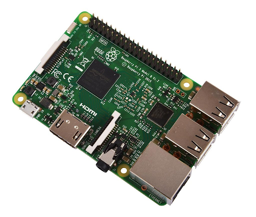

## Instalación

## **Requisitos de hardware y software**

- **Raspberry Pi (RPi)**: Al menos el modelo 3B.
- **Tarjeta de memoria micro SD:** de al menos 8 GB de capacidad.
- **1 lector de tarjetas de memoria SD**
- **1 cable HDMI**
- **1 teclado USB**
- **1 alimentador de cable micro USB**
- **Software** [**BalenaEtcher**](https://www.balena.io/etcher/) **.** para grabar la imagen ISO en la tarjeta SD

## **Arquitectura de sistemas para la PoC**

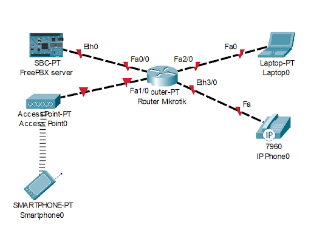

Dispondremos de un router con servidor DHCP con funciones de switch para dar conectividad a todos los dispositivos cableados: la Raspberry Pi, el punto de acceso wifi, los teléfonos IP y los PC con _ShoftPhone_.

El Punto de Acceso wifi se ha montado para suplir la carencia de conectividad WiFi del router. Así podremos utilizar _SmartPhone_ con aplicaciones _ShoftPhone_ para llamar.

## **Instalación de Asterisk-FreePBX**


1. Lo primero y más importante es descargar el archivo de imagen de Asterisk y asegurarse de extraer el archivo .img del archivo zip. [Este es el sitio web oficial para la descarga](https://oeey72xjc477aind5jd4le7iai-ac4c6men2g7xr2a-raspberry-asterisk.translate.goog/downloads/). Esto nos descargará el fichero raspbx-10-10-2020.zip
2. Descomprimimos el ,zip obteniendo un archivo .img
3. Descargamos, instalamos y ejecutamos el software [BalenaEtcher](https://www.balena.io/etcher/). Con el lector de tarjetas SD conectado y la tarjeta micro SD introducida, se hace la grabación de la imagen utilizando esta herramienta:

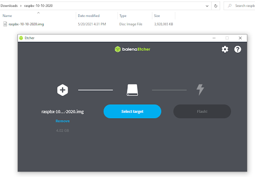

4. Una vez que el proceso anterior ha acabado. Desconectamos la tarjeta y la introducimos en la RPi.
5. Conectamos la RPi al monitor y teclado. Y la encendemos. Mostrará el siguiente proceso de arranque:

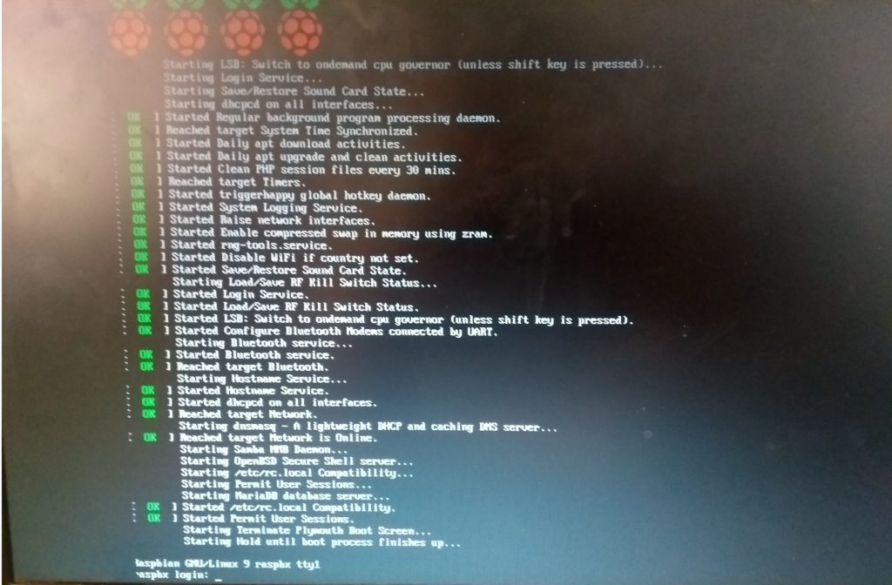

6. Una vez que aparece el mensaje de inicio de sesión, se ingresa el nombre de usuario como " **root**" y la contraseña como " **raspberry**". Seguidamente la consola nos confirmará la disponibilidad de la aplicación RaspPBX con mensajes de versión y la lista de comandos de bajo nivel para añadir extensiones y funcionalidades:

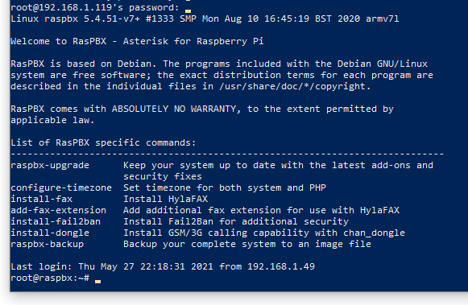

7. Aquí hay dos opciones de configuración para la conexión a red:
 * Por cable. No hay que nacer nada. Ya que obtendrá su IP del servidor DHCP. Pero tendremos que averiguar la IP asignada. Se puede utilizar el comando: ifconfig
 * O podemos configurar la Wifi manualmente con una IP fija (asegurarse que está libre para que no haya conflictos):
  1. Ingrese el siguiente comando para configurar WiFi escribiendo una configuración de este tipo
  2. _sudo nano /etc/network/interfaces_
```hash
      auto wlan0
      allow-hotplug wlan0
      iface wlan0 inet static
      address 192.168.1.199
      netmask 255.255.255.0
      gateway 192.168.1.1
      wpa-conf /etc/wpa\_supplicant/wpa\_supplicant.conf
```
  3. Ctrl-X, luego escriba Y para salir y guardar
  4. Ingrese el siguiente comando:
  5. _sudo nano /etc/wpa\_supplicant/wpa\_supplicant.conf_
      ```xml
      network={
      ssid="YOUR\_NETWORK\_NAME"
      psk="YOUR\_NETWORK\_PASSWORD"
      proto=RSN
      key\_mgmt=WPA-PSK
      pairwise=CCMP
      auth\_alg=OPEN
      }
      ```
  6. Ctrl-X, luego escriba Y para salir y guardar
  7. Escriba reiniciar y presione enter para reiniciar raspberry pi
  8. Una vez logueado en el sistema con el usuario **root** y la password elegida. Tecleamos el siguiente comando para ver qué conectividad tenemos y la IP asignada:
  9. _ifconfig_
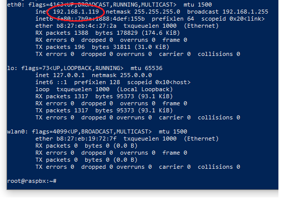

---
8. Ahora ya podemos entrar en la aplicación FreePBX: desde nuestro navegador favorito sencillamente poniendo la dirección de la IP de la RPI, que en nuestro caso es 192.168.1.119.
9. En el primer acceso se nos va a pedir el usuario y contraseña del administrador. Así como una dirección de mail:

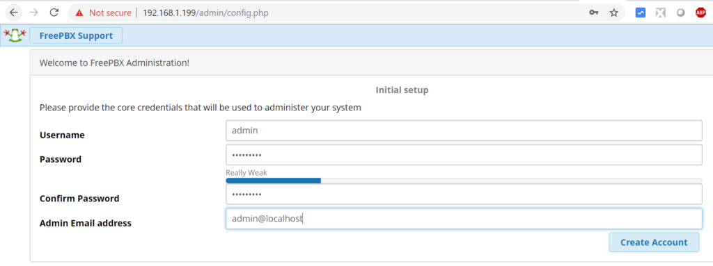

10. Hacemos clic en Administración de FreePBX

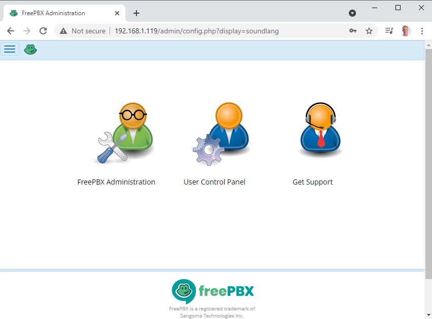

11. Escribimos el nombre de usuario (admin) y la contraseña que se creó en el paso anterior.
12. Hacemos clic en Continuar

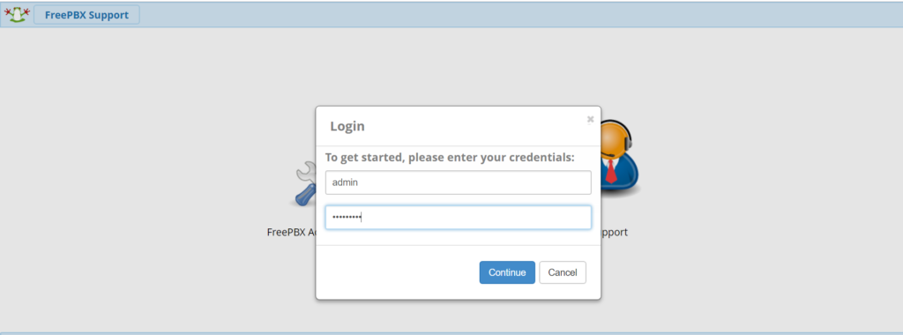

13. Seleccionamos las siguientes configuraciones:
  * **Idioma del mensaje** de sonido: seleccionamos el idioma del mensaje en el menú desplegable
  * **Idioma del sistema** : seleccionamos el idioma del sistema en el menú desplegable
  * **Zona horaria** : seleccionamos la zona horaria adecuada
14. Hacemos clic en Enviar

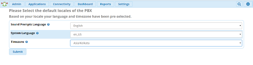

15. El Asterisk / FreePBX está listo para usar:
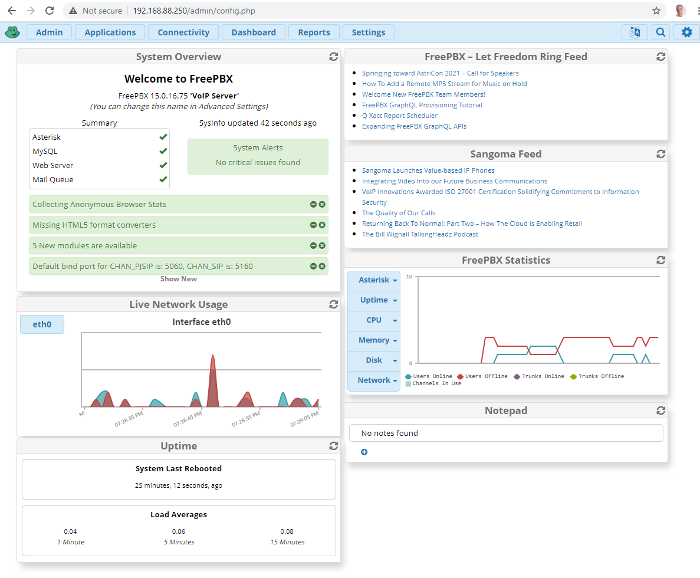

## Añadir extensiones y teléfonos

Una vez logueado como administrador tendremos la capacidad de añadir extensiones. Iniciamos el formulario desde la opción de Aplicaciones/Extensiones:

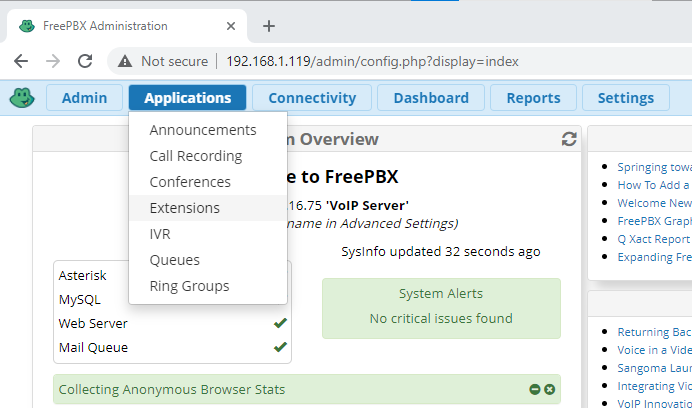

La configuración más adecuada para hacer una conexión sencilla sin tener que hacer configuraciones adicionales en nuestros elementos de red como abrir puertos, es el tipo SIP. Y preferiblemente la versión 'chan\_pjsip' por compatibilidad con programas _softphone._ !
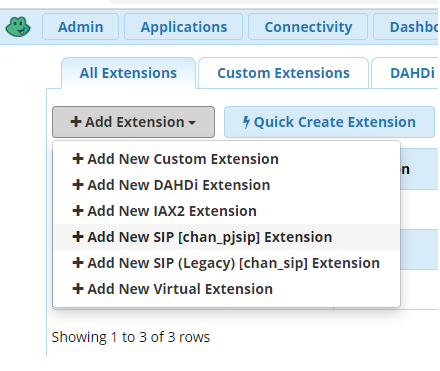

En el formulario de la configuración de la extensión, sólo tendremos que rellenar los tres campos imprescindibles del número de extensión, nombre y clave:

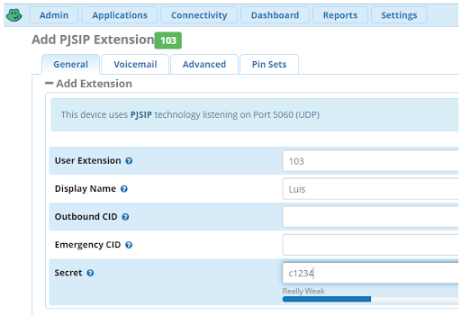

Tras pulsar el botón de _Submit_. Esta nueva entrada se añadirá a la lista de extensiones. Pero hasta que no apliquemos los cambios pulsando _Apply Config_, esta configuración no quedará guardada. Si la Raspberry Pi es un modelo antiguo (3 o 2) el proceso puede tardar más de un minuto.

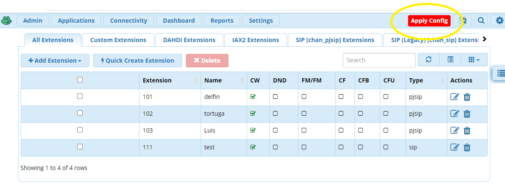

### Configurar un _softphone_
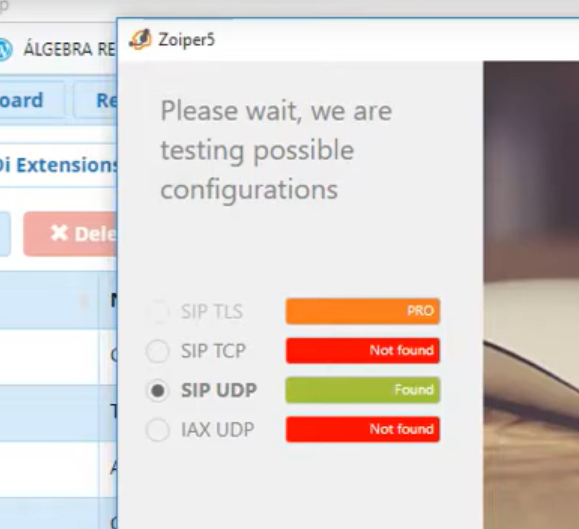

Vamos a utilizar [Zoiper](https://www.zoiper.com/)tanto en un equipo Windows 10 como en iOS. Por lo que, una vez descargado el programa, lo instalaremos.

Tras ejecutar el programa y aceptar su uso bajo licencia o libre. Nos pedirá la IP de nuestro servidor Asterisk para comprobar la conectividad.

Si obtenemos verde en el protocolo UDP, podremos pasar a añadir una cuenta (account) desde el botón [Add]:

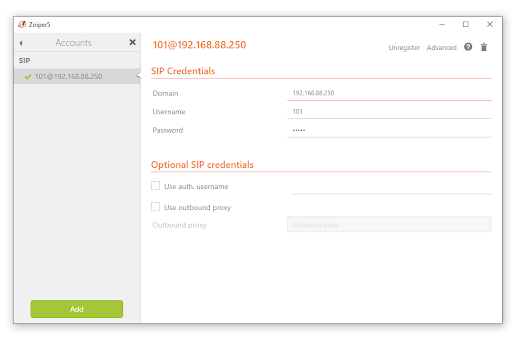

La configuración es tan simple como poner la IP de la Raspberry Pi en el campo _Domain_ el user name coincide con la extensión y el _Password_ registrado anteriormente en la consola de administración de FreePBX.

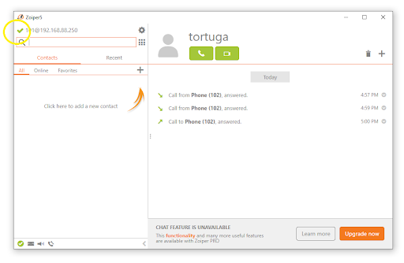

Cuando la aplicación se conecte con el servidor, aparecerá el símbolo de ok en color verde pudiendo hacer y recibir llamadas.

El registro de todas las llamadas queda reflejado en la parte derecha de la aplicación.

### Configurar un _Teléfono IP_

A fin de hacer la práctica lo más completa posible. Vamos a configurar un teléfono IP aprovechando que el router utilizado (MikroTik RB201) tiene activado el servidor DHCP que nos asignará IP al teléfono.

La configuración tendremos que hacerla tanto en FreePBX añadiendo una nueva extensión también del tipo PJSIP. Como en el propio terminal. Para lo que tenemos dos opciones: hacerlo desde las opciones de menú de su propio display. O desde la página web de configuración que nos sirve el teléfono cuando accedemos desde un navegador a su IP.

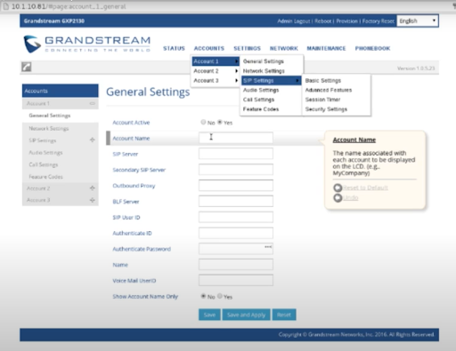

En cualquier caso tendremos que seguir estos pasos de configuración:

1. Selecciona el menú desplegable "Cuentas"> Selecciona "Cuenta 1"> Selecciona "Configuración general"
  * "Nombre de cuenta" debe ser la extensión que se creó en FreePBX
  * "Servidor" será la IP
  * El "ID de usuario SIP" es el número de extensión
  * El "ID de autenticación" es el número de extensión
  * Pegue la clave secreta de FreePBX en el cuadro de texto "Autenticar contraseña"
  * "Nombre" puede ser lo que se quiera. P.e. "TestPhone"
2. Vuelva a la administración de Grandstream> Selecciona: "Cuenta 1"> Seleccione "Configuración general"
3. Poner la dirección IP del paso anterior en el campo de texto "Servidor SIP"
4. Hacer clic en "Guardar" para aplicar los cambios de configuración.
5. Seleccionar la "Configuración SIP"> "Configuración básica".
6. Seleccionar el "Puerto SIP local" en el campo de texto (cada teléfono único debe tener su propia entrada única)

### Analizando la configuración

Las configuraciones hechas a través de la aplicación frontal de FreePBX va quedar grabadas en varios ficheros del sistema que podemos ver y que no debemos modificar tal y como advierten los mensajes que contienen.

- **sip.additional.conf**

Este archivo contiene los detalles de las extensiones configuradas con el tipo SIP que la aplicación tiene identificada como _Legacy_. O sea en desuso.

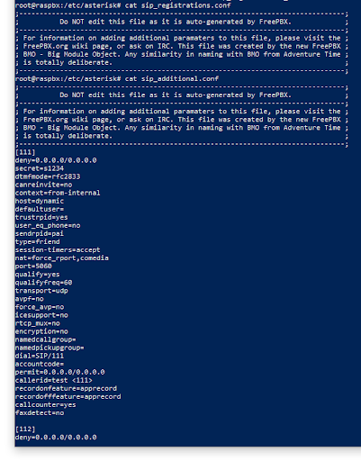

- **jpsip.aor.custom.conf**

Las extensiones configuradas con el tipo JPSIP quedan registradas en una serie de archivos. Este contiene un resumen con algunos parámetros de limitación u caducidad:

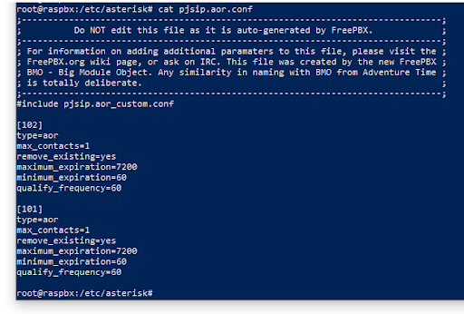

- **extensions.additional.conf**

En este archivo encontraremos en el apartado [ext-local] la relación de todas extensiones configuradas manualmente con el tipo en la última línea.

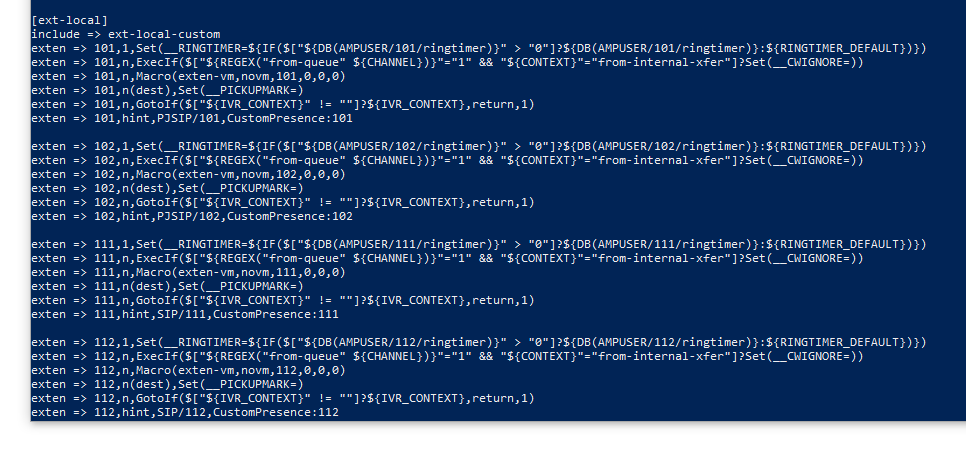

Por otra parte es posible acceder al programa nativo de administración de consola de Asterisk como si se tratara de un servidor sin FreePBX.

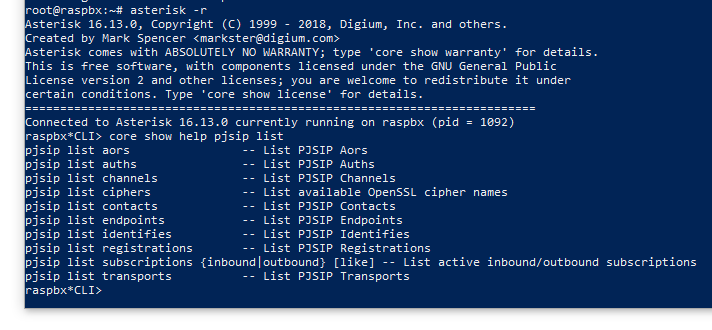

Si estamos trabajando con extensiones de tipo PJSIP, el comando: "pjsip list endpoints" es muy útil para listar los usuarios y su estado.

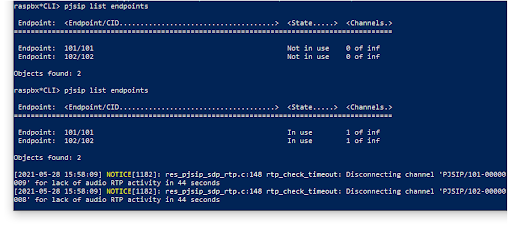

## Haciendo la primera llamada

Una vez asegurada la asignación de IP a cada uno de los teléfonos IP físicos o por software. Podremos hacer llamadas indiscriminadamente entre ellos ya que no hemos configurado ningún tipo de restricción.

Por parte del servidor FreePBX tenemos un _dashboard_ muy completo con la información de configuración y estado más relevante. En el marco de _Summary_ tenemos una _checklist_ que debe estar toda en verde.

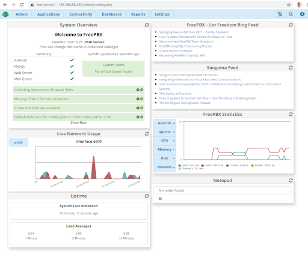

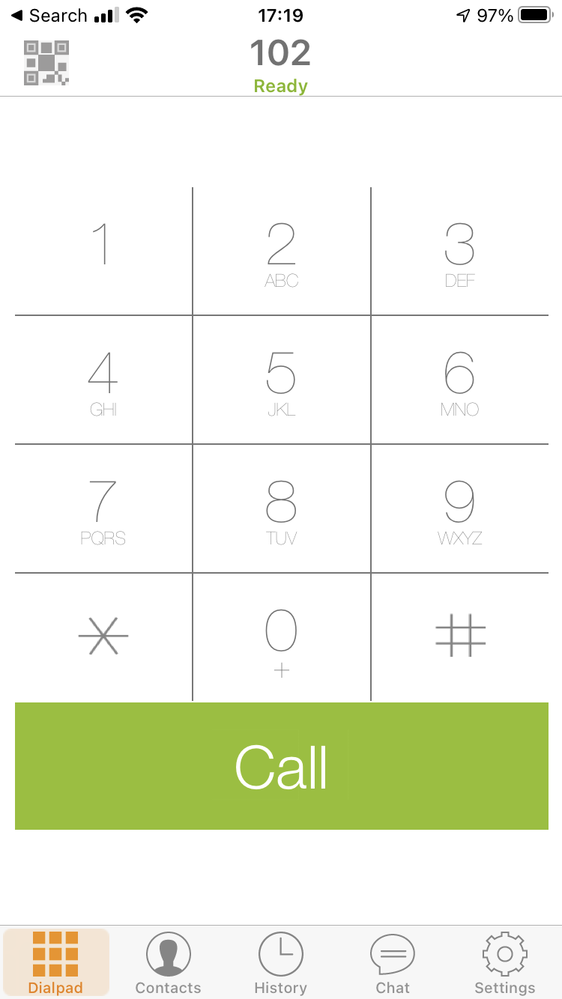

En este punto ya podemos hacer una llamada. Por ejemplo, desde la aplicación del smartphone donde tenemos configurada la terminal 102, vamos a llamar al número 101 que es el _shoftphone_ en un ordenador portátil. 
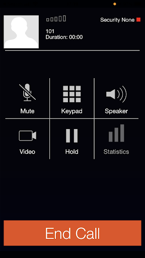

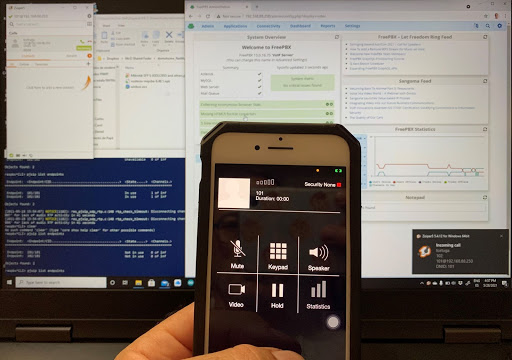

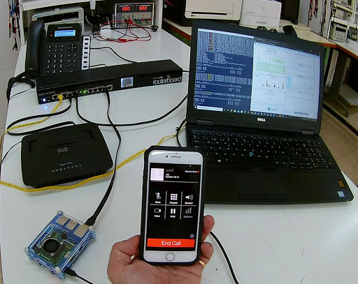
